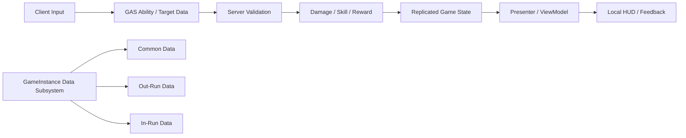

# NeoSanctum

> 최대 4명의 플레이어가 협력해 스테이지를 돌파하고, 증강과 부품을 조합해 자신만의 빌드를 완성하는 TPS 로그라이트 게임


[게임 플레이 영상](https://www.youtube.com/watch?v=qFWFm6H_kaA) · [게임 다운로드](https://drive.google.com/file/d/1tX6pFG5ueuZwxu6wWUnvAsbN-SrwI_Cl/view)

---

## 목차

- [About](#about)
- [Features](#features)
- [Gameplay](#gameplay)
- [Playable Characters](#playable-characters)
- [Stages](#stages)
- [Enemies](#enemies)
- [Bosses](#bosses)
- [Progression](#progression)
- [Systems](#systems)
- [Network Architecture](#network-architecture)
- [Controls](#controls)
- [Tech Stack](#tech-stack)
- [Project Structure](#project-structure)
- [Team](#team)
- [Download](#download)
- [Trailer](#trailer)
- [Credits](#credits)
- [License](#license)

---

## About

**NeoSanctum**은 포스트 아포칼립스 세계를 배경으로 하는 1~4인 협동 TPS 로그라이트 게임입니다.

플레이어는 폐허가 된 협곡, 추락한 함선, 생체 연구 시설을 탐색하며 몰려오는 로봇 적들과 전투합니다. 스테이지의 전투 목표를 완수하고 보스를 처치한 뒤, 다음 스테이지로 진입하거나 획득한 보상을 가지고 거점으로 귀환할 수 있습니다.

한 번의 런에서는 무작위로 제공되는 증강과 부품을 조합해 빌드를 완성합니다. 런이 끝난 뒤에는 공용 업그레이드, 부품, 동료 드론과 같은 장기 성장 요소를 통해 다음 도전을 준비할 수 있습니다.

### 프로젝트 정보

| 항목 | 내용 |
| --- | --- |
| 장르 | TPS / Co-op / Roguelite |
| 플레이 인원 | 1~4인 |
| 플랫폼 | Windows |
| 엔진 | Unreal Engine 5.7 |
| 개발 언어 | C++ / Blueprint |
| 네트워크 | Listen Server / Steam |
| 개발 기간 | 2026.05.14 ~ 2026.07.22 |
| 개발 인원 | 8명 |
| 팀 | One Team |
| 기본 언어 | 한국어 |
| 그래픽 API | DirectX 12 / Shader Model 6 |

---

## Features

### 최대 4인 협동 전투

Listen Server 기반으로 최대 4명의 플레이어가 하나의 세션에서 협력할 수 있습니다.

플레이어마다 서로 다른 캐릭터와 증강 조합을 선택할 수 있으며, 적의 어그로 분산, 보스 패턴 대응, 생존과 화력의 균형이 중요한 전투 구조를 가집니다.

플레이어의 체력, 실드, 캐릭터, 증강, 부품, 런 재화, 전투 통계와 스테이지 상태는 서버를 기준으로 관리됩니다.

### 캐릭터별 전투 스타일

각 캐릭터는 독립적인 기본 공격과 액티브 스킬, 전용 증강을 보유합니다.

- 연속 사격과 폭발물을 사용하는 Ranger
- 산탄총, 터렛, 배리어를 운용하는 Engineer
- 근접 콤보와 돌진, 순간 이동 공격을 사용하는 Vanguard

캐릭터를 변경하면 공격 방식뿐만 아니라 적용 가능한 전용 증강과 영구 성장 항목도 함께 달라집니다.

### 증강 빌드 시스템

전투와 레벨업 보상을 통해 무작위 증강 카드를 선택할 수 있습니다.

증강은 체력, 실드, 공격력, 방어력, 치명타와 같은 공용 능력치뿐 아니라 캐릭터별 스킬의 피해량, 범위, 지속 시간, 재사용 대기시간, 충전 횟수와 공격 방식을 변화시킵니다.

일부 증강에는 능력치를 크게 강화하는 대신 다른 능력치를 감소시키는 트레이드오프가 존재합니다.

### 랜덤 부품과 장비 성장

플레이어는 런 도중 팔, 몸통, 다리 부품을 획득하고 교체할 수 있습니다.

부품은 등급과 무작위 능력치를 가지며 캐릭터 외형에도 반영됩니다. 부품 상점과 강화 NPC를 통해 구매, 등급 강화, 능력치 재설정을 진행할 수 있습니다.

### 다양한 스테이지 목표

스테이지는 단순한 적 처치뿐 아니라 여러 형태의 전투 목표를 제공합니다.

- 지정된 수의 적 처치
- 스테이지에 갇힌 NPC 구조
- 보스 입구 집결
- 보스 전투
- 다음 스테이지 또는 거점 귀환 투표

### 시간·스테이지·인원 기반 난이도

런이 길어질수록 적의 능력치와 스폰 규모가 증가합니다.

기본 설정값을 기준으로 난이도는 다음 요소를 반영합니다.

- 일정 시간마다 적 능력치 상승
- 스테이지 진행에 따른 추가 난이도
- 참가 인원에 따른 적 체력, 공격력, 방어력 증가
- 참가 인원에 따른 적 스폰 수 증가

모든 수치는 데이터와 커브를 통해 조정할 수 있도록 구성되어 있습니다.

### 데이터 기반 적과 보스

적의 능력치, 공격, 외형, 페이즈와 행동 방식은 데이터 에셋과 데이터 테이블을 통해 정의됩니다.

적 AI는 Behavior Tree와 StateTree를 함께 사용하며, 근거리·원거리·비행·엘리트·보스처럼 서로 다른 전투 역할을 지원합니다.

### 런과 영구 성장의 결합

증강과 런 부품은 현재 도전에 직접적인 영향을 줍니다. 거점에서는 런에서 획득한 보상을 사용해 공용 능력치, 캐릭터별 능력, 영구 부품과 동료 드론을 성장시킬 수 있습니다.

---

## Gameplay

### 기본 플레이 흐름

```text
타이틀
→ 방 생성 또는 초대 코드로 참가
→ 거점 입장
→ 부품·동료·캐릭터 공용 업그레이드 설정 (영구 유지)
→ 모든 플레이어 준비
→ 스테이지 진입
→ 전투 목표 수행
→ 경험치·재화·부품 획득
→ 증강 선택 및 빌드 구성
→ 보스 입구 집결
→ 보스 전투
→ 결과 및 보상 확인
→ 다음 스테이지 / 거점 귀환 투표
```

### 거점

거점은 한 번의 런을 준비하는 공간입니다.

거점에서 다음 활동을 진행할 수 있습니다.

- 플레이 캐릭터 선택
- 공용 업그레이드
- 부품 구매 및 장착
- 동료 드론 선택과 강화
- 잠긴 NPC 시설 해금
- 파티 준비 상태 설정
- 새로운 런 시작

모든 플레이어가 준비를 완료하면 호스트가 런을 시작합니다.

### 이동과 전투

플레이어는 이동, 점프, 대시, 장애물 넘기, 사격과 캐릭터별 액티브 스킬을 활용해 전투합니다.

공격 판정은 서버 권한을 기준으로 처리됩니다. 플레이어의 조준 데이터는 서버에서 검증되며, 총구가 벽에 막혔는지 또는 공격 방향이 유효한지도 함께 검사합니다.

플레이어는 체력과 실드를 보유합니다. 실드가 남아 있을 경우 실드가 피해를 먼저 흡수하며, 조건을 만족하면 일정 시간 뒤 다시 충전됩니다.

기본 방어력 계산은 다음 구조를 사용합니다.

```text
최종 피해량
= 기본 피해량
× 방어 상수 / (방어 상수 + 대상 방어력)
× 치명타 배율
```

방어 상수와 세부 수치는 런 설정 데이터에서 조정할 수 있습니다.

### 스테이지 목표

스테이지가 시작되면 목표 풀에서 현재 목표가 결정됩니다.

현재 구현된 주요 목표는 다음과 같습니다.

- `Kill Count`: 요구 수만큼 적 처치
- `Rescue NPC`: 스테이지 내부의 구조 대상 NPC 구출

목표를 완수하면 보스 입구가 활성화되고 경계 VFX와 집결 UI가 표시됩니다.

### 보스 입구 집결

보스 전투는 살아 있는 플레이어들의 집결 상태를 기준으로 시작됩니다.

기본 설정에서는 보스 입구 활성화 후 카운트다운이 시작됩니다. 모든 생존 플레이어가 입구에 모이면 대기 시간이 짧아지고, 집결이 완료되면 전원이 보스 시작 지점으로 이동합니다.

이후 스테이지 BGM이 보스 BGM으로 전환되고 보스 스포너가 활성화됩니다.

### 사망과 관전

플레이어가 사망하면 남아 있는 팀원을 관전할 수 있습니다.

관전 상태에서는 다른 생존 플레이어의 카메라로 이동할 수 있으며, 모든 플레이어가 사망하면 런 실패 절차가 시작됩니다.

### 런 종료와 투표

보스를 처치하거나 파티가 전멸하면 결과 단계로 진입합니다.

결과 화면에서는 다음 정보가 집계됩니다.

- 런 진행 시간
- 처치한 일반 적 수
- 처치한 엘리트 수
- 처치한 보스 수
- 발사 횟수와 명중 횟수
- 누적 피해량
- 런에서 획득한 재화
- 최종적으로 정산되는 영구 재화

보스 처치 후에는 다음 스테이지 진행 또는 거점 귀환을 투표할 수 있습니다.

런에 실패한 경우에는 설정된 실패 배율을 적용해 일부 보상을 정산합니다. 기본 코드 설정에서는 성공 시 런 재화의 100%, 실패 시 50%를 기준으로 처리할 수 있도록 구성되어 있습니다.

---

## Playable Characters

### Ranger

연속 사격과 폭발 공격에 특화된 원거리 전투 캐릭터입니다.

주요 전투 요소:

- 연속 히트스캔 자동 사격
- 탄약과 재장전
- 강력한 투사체 사격
- 투척형 수류탄
- 이동 및 공격 템포를 높이는 버프
- 공격력, 발사 속도, 탄약, 폭발 범위를 변경하는 전용 증강

서버는 클라이언트가 전달한 조준 방향과 총구 위치를 검증한 뒤 최종 공격 판정을 수행합니다.

### Engineer

산탄총과 설치형 장비를 활용해 전장을 통제하는 캐릭터입니다.

주요 전투 요소:

- 다중 펠릿 산탄총 공격
- 자동으로 적을 공격하는 터렛 소환
- 피해를 차단하거나 전투 공간을 구분하는 배리어
- 플레이어와 소환물에 적용할 수 있는 전투 버프
- 펠릿 수, 탄 퍼짐, 터렛 사거리와 정확도 등을 변경하는 전용 증강

터렛은 Engineer의 소유 오브젝트로 관리되며, 일부 버프와 성장 효과를 함께 적용받습니다.

### Vanguard

근접 콤보와 기동 공격에 특화된 전위 전투 캐릭터입니다.

주요 전투 요소:

- 3단 지상 기본 공격 콤보
- 공중 강하 공격
- 충전형 돌진 공격
- 조준한 적에게 빠르게 접근하는 `Flicker`
- 연속 적중에 따른 Flicker 연계
- 투척형 배리어 필드
- 근접 전투를 강화하는 범위 버프

근접 공격과 돌진, 순간적인 위치 변경을 조합해 적 진형에 진입하고 빠르게 이탈하는 플레이를 지향합니다.

---

## Stages

NeoSanctum의 인런 맵은 수작업으로 제작한 방 모듈과 절차적 연결 구조를 결합합니다.

각 테마에는 다음과 같은 방이 독립된 모듈로 구성되어 있습니다.

- 플레이어 시작 방
- 일반 전투 방
- 통로
- NPC 구조 방
- 부품 NPC 방
- 보스 방

### Canyon

협곡과 절벽, 교량과 개방된 전투 공간을 중심으로 구성된 스테이지입니다.

높낮이 차와 넓은 시야가 특징이며, 원거리 적과 비행 적에 대응하면서 엄폐물을 활용해야 합니다.

### Ark Wreckage

추락하거나 파괴된 함선 내부를 탐색하는 스테이지입니다.

통로와 밀폐된 전투 공간, 함선 내부 구조물을 활용한 근거리 전투가 중심이 됩니다.

### Bio Lab

오염된 식생과 실험 시설이 결합된 생체 연구 구역입니다.

연구 시설의 복도, 대형 실험실, 이형 식물과 유리 구조물로 구성된 공간을 탐색합니다.

### 모듈형 스테이지 구성

각 스테이지는 별도의 Room Data와 생성기 Blueprint를 사용합니다.

수작업으로 설계된 방의 전투 밀도와 연출을 유지하면서, 방 연결과 진행 순서에 변화를 줄 수 있는 구조입니다.

---

## Enemies

### 적 분류

적은 전투 역할과 등급에 따라 구분됩니다.

| 분류 | 설명 |
| --- | --- |
| 근거리 | 플레이어에게 접근해 휘두르기 또는 범위 공격 수행 |
| 원거리 | 일정 거리를 유지하며 투사체 또는 히트스캔 공격 수행 |
| 비행 | 고도를 유지하고 장애물을 회피하며 원거리 공격 수행 |
| 고정형 | 특정 위치에서 포탑 또는 지역 방어 역할 수행 |
| 엘리트 | 강화된 능력치와 패턴, 더 높은 보상을 가진 적 |
| 보스 | 페이즈와 전용 패턴을 가진 스테이지 핵심 적 |

### AI 인식과 타깃 선택

적 AI는 시야와 청각, 데미지를 통해 플레이어를 감지합니다.

감지된 플레이어는 위협도 시스템에 등록되며, 적은 다음 요소를 바탕으로 공격 대상을 선택합니다.

- 현재 위협도
- 플레이어와의 거리
- 시야 확보 여부
- 공격 가능 범위
- 현재 공격의 우선순위
- 공격별 가중치와 재사용 대기시간

### 근거리 적 분산

근거리 적은 공격 예약 시스템을 사용합니다.

동시에 지나치게 많은 적이 한 플레이어에게 겹쳐 공격하는 현상을 완화하고, 주변 적들이 이동·대기·진입 상태를 나누어 갖도록 구성되어 있습니다.

### 비행 AI

비행 적과 드론은 별도의 비행 로코모션 컴포넌트를 사용합니다.

- 지형을 추적하는 고도 유지
- 여러 방향의 장애물 위험도 계산
- 목표 방향과 회피 방향의 가중치 비교
- 사방이 막힌 경우 후퇴
- 플레이어 이동을 예측한 발사
- 적정 사거리 유지와 카이팅
- 스턱 감지 및 복구

### 공격 선택

적은 현재 거리, 시야, 공격 가능 상태와 공격 데이터에 따라 사용할 능력을 선택합니다.

지원되는 대표 공격 방식은 다음과 같습니다.

- 근접 스윕
- 투사체
- 히트스캔
- 범위 공격
- 다중 발사
- 예측 사격
- 지속 피해
- 포격
- 레이저
- 미사일

### 경직 게이지

일반 적은 피해를 받을 때 경직 게이지가 누적됩니다.

게이지가 최대치에 도달하면 진행 중인 공격이 취소되고 전신 경직이 발생합니다. 이를 활용하면 위험한 공격 패턴을 중단시키거나 집중 공격의 타이밍을 만들 수 있습니다.

### 사망과 풀링

적은 사망 시 몽타주 또는 래그돌 상태로 전환되며, 디졸브 연출이 끝난 뒤 오브젝트 풀로 반환됩니다.

반복적인 스폰과 파괴 비용을 줄이기 위해 일반 적과 엘리트가 데이터별 풀을 사용합니다.

---

## Bosses

### Titan Walker

다양한 공격 모드와 부위 상태를 사용하는 지상형 보스입니다.

StateTree를 통해 현재 모드, 공격 가능 여부와 이동 상태를 관리합니다.

대표 모드:

- 이동 모드
- 공성 모드
- 코어 노출
- 다리 파괴

대표 공격:

- 기관총 연사
- 화염 방사
- 추적형 직선 레이저
- 지속 레이저 피해
- 광역 포격

#### 포격 패턴

Titan Walker의 포격 시스템은 공격 지점과 발사 타이밍을 서로 조합할 수 있도록 설계되어 있습니다.

대표 배치 방식:

- 모든 플레이어를 대상으로 포격
- 가장 높은 위협도를 가진 플레이어 집중 공격
- 플레이어 사이 공간 차단
- 경기장 중심의 원형 파동
- 현재 위치 또는 예상 이동 위치 공격

대표 타이밍 방식:

- 순차 발사
- 무작위 발사
- 동시 발사
- 짧은 연속 발사
- 웨이브 발사
- 빠른 포격과 지연 포격의 엇박자 조합

패턴별 하드 쿨다운과 반복 방지 규칙을 통해 동일한 공격이 연속으로 선택되는 현상을 줄입니다.

공격 전에는 데칼, Niagara 경고와 타이밍 연출을 표시해 플레이어가 회피 위치를 판단할 수 있도록 합니다.

### MotherShip

전투 페이즈에 따라 고정형 포탑에서 비행 보스로 변화하는 보스입니다.

#### 1페이즈

MotherShip은 고정된 위치에서 공격하며, 주변 제어 장치와 연동된 무적 배리어를 사용합니다.

플레이어는 먼저 전투 공간에 배치된 제어 장치를 파괴해야 보스에게 직접 피해를 줄 수 있습니다.

#### 2페이즈

페이즈 전환 시 MotherShip은 이동이 활성화되고 보스 실드를 획득합니다.

기본 설정에서는 페이즈 전환 과정에서 플레이어 실드의 일부를 제거해 전투 압박을 높입니다.

대표 공격:

- 비행 상태의 다중 사격
- 유도 미사일
- 폭격 비행
- 은폐 이동
- 드론 배치
- 전투 드론 재소환

MotherShip이 생성한 드론은 파괴된 뒤 일정 시간이 지나면 다시 전투에 투입될 수 있습니다.

---

## Progression

### Augment System

증강은 현재 런 동안 플레이어의 능력과 스킬을 변화시키는 핵심 성장 요소입니다.

#### 증강 등급

- Common
- Rare
- Epic
- Legendary

#### 증강 대상

증강은 다음과 같은 항목에 적용될 수 있습니다.

- 최대 체력
- 기본 공격력
- 최대 실드
- 실드 재충전
- 방어력
- 치명타 확률
- 치명타 피해량
- 이동 속도
- 탄약과 재장전
- 스킬 피해량
- 스킬 범위
- 스킬 지속 시간
- 스킬 재사용 대기시간
- 스킬 충전 횟수
- 투사체 수
- 펠릿 수와 탄 퍼짐
- 터렛 사거리와 명중률
- 캐릭터별 특수 메커니즘

증강 효과는 덧셈 또는 배율 방식으로 적용됩니다.

#### 증강 선택

기본적으로 한 번에 3장의 서로 다른 증강 카드가 제공됩니다. 영구 업그레이드를 통해 선택지 수를 4장으로 확장할 수 있습니다.

카드는 다음 조건을 검증한 후 생성됩니다.

- 현재 캐릭터가 사용할 수 있는 증강인지
- 최대 중첩에 도달하지 않았는지
- 전설 슬롯에 여유가 있는지
- 해당 증강이 활성화되어 있는지
- 같은 선택 화면에 중복 카드가 없는지

전설 증강은 별도의 슬롯 제한을 가지며 기본 최대치는 3개입니다.

#### 증강 획득 시점

다음 이벤트가 증강 보상을 발생시킬 수 있습니다.

- 엘리트 보상
- 보스 보상
- 레벨 업

동시에 여러 보상이 발생한 경우 선택 요청을 FIFO 큐로 관리합니다.

#### 리롤

플레이어는 런 재화를 소비해 증강 선택지를 다시 생성할 수 있습니다.

리롤 비용은 사용 횟수에 따라 증가하며, 영구 유틸리티 업그레이드로 비용을 할인할 수 있습니다. 리롤 결과는 기존 선택지 전체와 완전히 동일하지 않도록 검증됩니다.

### Experience System

적을 처치하면 파티 플레이어가 경험치를 획득합니다.

경험치 바가 가득 차면 증강 선택 보상이 발생하며, 초과 경험치는 다음 경험치 주기로 이어집니다.

### Part System

부품은 런 도중 획득하는 장비이자 캐릭터 외형을 변경하는 요소입니다.

#### 부품 슬롯

- Arm
- Body
- Leg

#### 부품 등급

- Common
- Rare
- Epic
- Legendary

각 부품에는 등급별 범위에서 선택된 무작위 능력치가 부여됩니다.

부품을 교체하면 기존 부품은 월드에 드롭되며 다른 플레이어가 획득할 수 있습니다. 드롭된 부품은 일정 시간이 지나면 제거됩니다.

#### 부품 강화

인런 부품 NPC를 통해 다음 기능을 사용할 수 있습니다.

- 슬롯별 무작위 부품 구매
- 부품 등급 강화
- 확률 기반 강화
- 부품 능력치 재설정
- 구매 완료 상태 동기화

일부 부품은 설정에 따라 능력치 재설정이 제한될 수 있습니다.

#### 영구 부품

거점에서는 영구 재화로 부품을 구매하고 캐릭터별 해금 슬롯에 장착할 수 있습니다.

부품 선택 UI는 별도의 3D 프리뷰 스테이지와 Render Target을 사용하며, 캐릭터를 회전하거나 확대해 외형을 확인할 수 있습니다.

### Currency System

프로젝트는 용도가 다른 여러 재화를 사용합니다.

| 재화 | 용도 |
| --- | --- |
| 런 재화 | 현재 런의 증강 리롤, 부품 구매와 강화 |
| 공용 재화 | 공용 영구 업그레이드와 시설 해금 |
| 캐릭터 재화 | 캐릭터별 스킬과 성장 |
| 보상 드롭 | 일반·엘리트·보스·상자 보상에서 생성 |

재화와 회복 아이템은 서버가 실제 획득 가능 상태를 관리하며, 클라이언트는 로컬 시각 오브젝트를 표시합니다.

### Permanent Progression

저장 데이터에는 다음 정보가 포함됩니다.

- 공용 재화
- 해금된 NPC
- 공용 스킬 레벨
- 캐릭터별 재화
- 캐릭터별 스킬 레벨
- 캐릭터별 부품 슬롯
- 소유한 영구 부품
- 캐릭터별 장착 부품
- 마지막으로 선택한 캐릭터
- 동료 드론 보유 상태
- 동료 드론 업그레이드
- 튜토리얼 진행 상태

공용 업그레이드는 다음 범주로 구분됩니다.

- Combat
- Survival
- Utility

업그레이드 비용은 기본 비용, 고정 증가량과 비율 증가량을 통해 계산할 수 있습니다.

### Companion System

플레이어는 거점에서 동료 드론을 선택하고 강화할 수 있습니다.

대표 동료 유형:

- 기본 탐색·수집 드론
- 전투형 드론

동료 드론은 다음 상태를 전환하며 행동합니다.

```text
Follow
↔ Collect
↔ Combat
```

주요 기능:

- 플레이어 추적
- 주변 재화 탐색
- 재화 자동 수집
- 적 탐색
- 예측 사격
- 사거리 유지
- 플레이어와 너무 멀어졌을 때 복귀
- 스턱 감지 후 텔레포트 복구

동료의 공격력, 공격 속도, 탐지 범위와 수집 능력은 업그레이드 노드로 성장시킬 수 있습니다.

---

## Systems

### Gameplay Ability System

플레이어, 적, 보스와 동료의 능력은 Gameplay Ability System을 중심으로 구성되어 있습니다.

주요 활용 범위:

- 기본 공격
- 액티브 스킬
- 대시
- 재장전
- 버프와 디버프
- 피해 처리
- 실드
- 치명타
- 증강 효과
- 영구 성장 효과
- 보스 공격
- 동료 공격

Gameplay Tag를 사용해 캐릭터, 능력, 상태, 공격 타입, 재화, 보상과 UI 이벤트를 식별합니다.

### Server-authoritative Combat

전투 판정과 주요 게임 상태는 서버를 기준으로 처리됩니다.

- 서버에서 최종 피해 계산
- 클라이언트 조준 데이터 검증
- 공격 시작 위치와 방향 검증
- 총구 장애물 검사
- 아군 공격과 자기 자신 공격 차단
- 사망한 대상에 대한 추가 피해 차단
- 무적 상태 검증
- 실드 우선 피해 처리
- 치명타 판정
- 처치 통계 기록

클라이언트는 피격 표시, 크로스헤어 변화, 피해 숫자, 사운드와 VFX를 통해 결과를 피드백받습니다.

### Hit Feedback

전투 피드백 시스템은 다음 요소를 제공합니다.

- 일반 명중 표시
- 치명타 표시
- 처치 표시
- 실드 피격 연출
- 월드 피해 숫자
- 크로스헤어 피드백
- 피격 방향 및 월드 반응
- 명중·처치 사운드
- 보스 공격 경고

### Enemy AI System

일반 적과 보스는 데이터에 따라 Behavior Tree 또는 StateTree를 선택할 수 있습니다.

AI 시스템의 주요 구성 요소:

- AI Perception
- Threat 관리
- 공격 선택
- 이동과 후퇴
- 근접 공격 예약
- 비행 로코모션
- EQS 기반 위치 선택
- 시야 및 엄폐 검사
- 동적 Nav Link
- 점프 이동
- 페이즈 전환
- 부위 파괴
- 경직 게이지

### Stage System

스테이지 상태는 다음 단계로 진행됩니다.

```text
Objective
→ Boss Ready
→ Boss Fight
→ Run Result
```

현재 목표, 보스 집결 상태, 난이도, 진행 시간과 투표 상태는 GameState를 통해 복제됩니다.

### Difficulty System

난이도는 시간, 스테이지와 플레이어 수를 조합해 계산합니다.

기본 코드 설정값:

| 요소 | 기본값 |
| --- | --- |
| 시간 난이도 적용 주기 | 60초 |
| 시간 단계별 증가율 | 10% |
| 스테이지 단계별 증가율 | 20% |
| 추가 플레이어당 적 능력치 증가율 | 30% |
| 추가 플레이어당 스폰 수 증가율 | 50% |

이 값은 기본값이며, 실제 런에서는 데이터 에셋과 난이도 커브 설정으로 변경할 수 있습니다.

보스 방 준비 및 전투 흐름에 따라 난이도 타이머를 일시 정지하거나 다시 시작할 수 있습니다.

### Object Pooling

대규모 전투에서 반복적인 생성과 제거 비용을 줄이기 위해 오브젝트 풀을 사용합니다.

대표 풀링 대상:

- 일반 적
- 엘리트 적
- 보스가 생성하는 드론
- 투사체 시각 오브젝트
- 재화 시각 오브젝트
- 회복 아이템 시각 오브젝트

스테이지 시작 전 일반 적과 엘리트 풀을 미리 준비하고, 로딩 화면은 레벨·플레이어·데이터·풀 준비 상태를 확인한 뒤 종료됩니다.

### High-volume Replication Optimization

투사체와 드롭 오브젝트처럼 자주 생성되는 요소는 모든 액터를 그대로 복제하는 대신 서버의 경량 상태와 클라이언트 시각 표현을 분리합니다.

- 서버가 충돌과 획득 가능 상태를 관리
- 서버가 생성·종료 이벤트를 경량 구조체로 전달
- 클라이언트가 로컬 시각 오브젝트 생성
- 소유자 전용 프록시를 통한 이벤트 전달
- 서버 검증 이후 재화 또는 회복 효과 적용

이 구조는 다수의 투사체와 드롭이 동시에 존재할 때 네트워크 액터 수를 줄이기 위한 방식입니다.

### Data Loading

게임 데이터는 사용 시점에 따라 단계적으로 로드됩니다.

```text
애플리케이션 시작
→ Common Data 로드
→ 타이틀 진입
→ Out-Run Data 로드
→ 거점 진입
→ Run Data 로드
→ 스테이지 진행
→ 런 종료
→ Run Data 해제
→ Out-Run Data 재로드
```

공용 데이터, 거점 데이터와 인런 데이터를 분리해 필요하지 않은 데이터가 계속 메모리에 남는 것을 줄입니다.

Primary Data Asset, Asset Manager, Asset Bundle과 비동기 Streamable Handle을 사용합니다.

### UI Architecture

UI는 CommonUI와 UMG를 기반으로 하며, Presenter·ViewModel·Subsystem 구조를 사용합니다.

주요 UI:

- 타이틀과 직접 주소 접속
- 캐릭터 선택
- HUD
- 체력과 실드
- 탄약과 재장전
- 스킬 쿨다운과 충전 횟수
- 대시 스택
- 경험치
- 런·영구 재화
- 증강 선택
- 보유 증강 목록
- 부품과 캐릭터 능력치
- 목표와 보스 집결 타이머
- 스테이지와 난이도
- 미니맵
- 나침반과 웨이포인트
- 팀원 상태
- 일반 적 체력
- 보스 체력
- 피해 숫자
- 관전
- 결과 및 투표
- 튜토리얼 가이드
- 일시 정지
- 옵션

### Minimap and Waypoint

미니맵은 캡처 기반 Render Target 또는 층별 사전 제작 텍스처를 사용할 수 있습니다.

월드 좌표를 미니맵 좌표로 변환하며 플레이어, 팀원, 목표, NPC와 주요 지점 아이콘을 표시합니다.

나침반과 웨이포인트 시스템은 로컬 마커 레지스트리를 통해 목표 방향을 안내합니다.

### Options

게임 내 옵션에서 다음 항목을 조절할 수 있습니다.

#### 그래픽

- 해상도
- 창 모드
- 프레임 제한
- 그래픽 품질
- 안티앨리어싱
- 수직 동기화

#### 게임플레이

- 마우스 감도
- 크로스헤어 RGB 색상
- 언어 설정

#### 사운드

- 마스터 볼륨
- BGM 볼륨
- SFX 볼륨
- UI 볼륨

옵션 상태는 로컬에 저장됩니다.

### Tutorial

거점과 인런에 각각 별도의 가이드 흐름이 존재합니다.

거점 가이드:

- 이동
- 점프
- 대시
- 캐릭터 선택 콘솔
- 준비 콘솔
- 새롭게 해금된 NPC 안내

인런 가이드:

- 캐릭터 능력치 및 부품 패널
- 증강 패널
- 증강 카드 선택
- 증강 리롤
- 튜토리얼 재화와 선택지 지급

---

## Network Architecture

NeoSanctum은 Listen Server 기반 협동 플레이를 지원합니다.



### 서버 권한 영역

- 세션 생성과 스테이지 이동
- 캐릭터 스폰
- 적과 보스 AI
- 공격과 피해 판정
- 목표 진행
- 보스 입구 집결
- 난이도 계산
- 경험치와 증강 보상
- 재화와 부품 획득
- 런 결과와 투표
- 저장 보상 정산

### 복제되는 주요 상태

- PlayerState
- 캐릭터와 동료
- 체력과 실드
- 캐릭터별 능력치
- 증강과 부품
- 런 재화
- 스테이지 페이즈
- 현재 목표
- 난이도
- 보스 집결
- 보스 상태
- 런 결과
- 플레이어 투표

### Seamless Travel

거점과 스테이지 사이 이동에는 Seamless Travel을 사용합니다.

PlayerState는 맵 이동 과정에서 다음 정보를 유지하거나 다시 적용합니다.

- 선택 캐릭터
- 런 증강
- 장착 부품
- 캐릭터 능력
- 동료
- 런 재화
- 플레이어 통계

### 세션 방식

현재 프로젝트 설정은 `OnlineSubsystemNull`을 사용합니다.

따라서 기본 빌드에서는 다음 방식으로 접속합니다.

- LAN 세션 생성
- 직접 IP 또는 주소 입력
- 최대 4개 공개 연결
- 호스트가 거점에서 세션 운영
- 런 시작 후 중도 참가 제한
- 거점 복귀 후 참가 재허용

> Steam, EOS 또는 별도 매치메이킹 서비스를 사용하려면 Online Subsystem 설정과 배포 환경을 추가로 구성해야 합니다.

---

## Controls

현재 Enhanced Input의 `IMC_NS_Gameplay` 설정을 기준으로 정리한 조작법입니다.

| 키 | 동작 |
| --- | --- |
| `WASD` | 이동 |
| `Mouse` | 시점 이동 및 조준 |
| `LMB` | 기본 공격 |
| `RMB` | 액티브 스킬 |
| `Q` | 액티브 스킬 |
| `E` | 액티브 스킬 |
| `Left Shift` | 대시 |
| `Space` | 점프 및 이동 액션 |
| `R` | 재장전 |
| `F` | 상호작용 |
| `C` | 캐릭터 능력치 및 부품 정보 |
| `Tab` | 증강 정보 확인 |
| `T` | 증강 리롤 |
| `1~4` | 증강 카드 선택 |
| `Esc` | 일시 정지 및 메뉴 |

캐릭터에 따라 `RMB`, `Q`, `E`에 연결된 스킬의 종류가 달라집니다.

---

## Tech Stack

### Engine and Language

- Unreal Engine 5.7
- C++
- Blueprint
- Unreal Build Tool

### Gameplay

- Gameplay Ability System
- Gameplay Tags
- Gameplay Tasks
- Enhanced Input
- Gameplay Message Runtime
- Gameplay Message Router

### AI

- Behavior Tree
- StateTree
- AI Perception
- Environment Query System
- Navigation System
- Smart Nav Link

### Animation

- Animation Blueprint
- Animation Layer
- Motion Warping
- Pose Search
- Chooser
- Motion Trajectory
- Root Motion

### UI

- CommonUI
- CommonInput
- UMG
- Slate
- Model-View-ViewModel
- Render Target 기반 3D 프리뷰

### Rendering and VFX

- DirectX 12
- Shader Model 6
- Lumen
- Virtual Shadow Maps
- Ray Tracing
- Substrate
- Niagara
- Niagara Fluids

### Physics

- Chaos Physics
- Geometry Collection
- Physics Asset
- Ragdoll

### Level Generation

- Procedural Dungeon 3.8.1
- PCG
- 수작업 Room Module
- Level Instance 및 Packed Level Actor

### Audio

- Audio Mixer
- 데이터 기반 BGM 및 SFX
- 위치·부착·2D 사운드
- 루프, 페이드와 피치 제어

### Network

- Online Subsystem
- Online Subsystem Utils
- NetCore
- Listen Server
- Seamless Travel
- Server-authoritative Gameplay
- Owner-only Replication Proxy

### Collaboration

- Git
- GitHub
- Git LFS
- Git LFS 2 Editor Plugin 3.16

---

## Project Structure

2026년 7월 22일 기준 C++ 모듈은 다음 규모로 구성되어 있습니다.

- 헤더 파일: 404개
- C++ 구현 파일: 373개
- Build 설정: 1개
- 전체 C++ 관련 파일: 778개
- 코드 라인: 약 113,500줄

```text
Source/NeoSanctum
├─ AI
│  ├─ Companion
│  ├─ Enemy
│  ├─ Components
│  ├─ EQS
│  └─ Navigation
├─ Character
│  ├─ Player
│  ├─ Enemy
│  ├─ Component
│  └─ Part
├─ Collision
├─ Combat
│  ├─ Component
│  ├─ Cosmetic
│  ├─ Projectile
│  └─ Warning
├─ Core
│  ├─ GameInstance
│  ├─ GameMode
│  ├─ GameState
│  ├─ PlayerController
│  ├─ PlayerState
│  ├─ Session
│  └─ Save
├─ Data
│  ├─ AI
│  ├─ Character
│  ├─ Config
│  ├─ Progression
│  └─ UI
├─ Debug
├─ GAS
│  ├─ AbilitySystem
│  ├─ AttributeSet
│  ├─ GameplayAbility
│  ├─ GameplayEffect
│  └─ TargetData
├─ Input
├─ Interaction
│  ├─ Component
│  ├─ NPC
│  └─ World
├─ Progression
│  ├─ Augment
│  ├─ Currency
│  ├─ Experience
│  ├─ Part
│  ├─ Reward
│  └─ Upgrade
├─ System
│  ├─ Component
│  ├─ Pool
│  ├─ Sound
│  └─ VFX
├─ Tag
├─ Type
└─ UI
   ├─ Augment
   ├─ CharacterSelect
   ├─ CommonUpgrade
   ├─ Core
   ├─ Guide
   ├─ HUD
   ├─ Interaction
   ├─ Loading
   ├─ Map
   ├─ Menu
   ├─ Monster
   ├─ Options
   ├─ Part
   ├─ PetUpgrade
   ├─ Player
   ├─ Result
   └─ Spectator
```

### 주요 디렉터리

| 디렉터리 | 설명 |
| --- | --- |
| `AI` | 일반 적, 보스, 동료 드론, Behavior Tree와 StateTree |
| `Character` | 플레이어·적 캐릭터와 모듈형 외형 |
| `Combat` | 피해 규칙, 공격 판정, 투사체, 경고와 전투 연출 |
| `Core` | GameMode, GameState, PlayerState, 세션, 저장과 게임 흐름 |
| `Data` | Primary Data Asset와 데이터 테이블 구조 |
| `GAS` | Ability, Effect, Attribute와 Target Data |
| `Interaction` | NPC, 월드 상호작용과 인터랙션 컴포넌트 |
| `Progression` | 증강, 경험치, 재화, 부품, 보상과 영구 성장 |
| `System` | 풀링, 사운드, VFX와 공용 런타임 시스템 |
| `Tag` | Native Gameplay Tag 정의 |
| `UI` | HUD, 메뉴, 증강, 부품, 미니맵, 결과와 옵션 |

### 프로젝트 플러그인

| 플러그인 | 버전/제작자 | 용도 |
| --- | --- | --- |
| Procedural Dungeon | 3.8.1 / Ben Pyton | 수작업 방 기반 절차적 스테이지 구성 |
| Gameplay Message Router | Epic Games | 분리된 게임플레이 오브젝트 간 메시지 전달 |
| Git LFS 2 | 3.16 / Project Borealis | Unreal Editor Git 및 Git LFS 연동 |
| Auto Asset Tool | One Team 프로젝트 도구 | 에셋 관리 자동화 |
| Part Icon Tool | One Team | 부품 메시를 촬영해 UI 아이콘 생성 |

---

## Development Setup

### 요구 사항

- Windows 10 또는 Windows 11
- Unreal Engine 5.7
- Visual Studio 2022 / Rider
- Desktop development with C++
- Windows 10/11 SDK
- Git
- Git LFS

### 저장소 실행

```bash
git lfs install
git clone <repository-url>
cd NeoSanctum
git lfs pull
```

이후 다음 순서로 실행합니다.

1. `NeoSanctum.uproject`의 Generate Visual Studio project files를 실행합니다.
2. 생성된 Solution을 Visual Studio 2022 또는 Rider에서 엽니다.
3. `Development Editor / Win64` 구성으로 빌드합니다.
4. `NeoSanctum.uproject`를 Unreal Engine 5.7로 실행합니다.
5. 타이틀 맵 또는 거점 맵에서 플레이합니다.

> 프로젝트에 포함된 유료 Marketplace 에셋은 원본 라이선스에 따라 재배포가 제한될 수 있습니다. 공개 저장소에 업로드하기 전 반드시 각 에셋의 배포 조건을 확인하세요.

---

## Team

| 이름 | 역할 | 주요 담당 |
| --- | --- | --- |
| 정주현 (`Joung_Juhyeon`) | Gameplay Programmer | 플레이어 캐릭터, GAS, 전투와 캐릭터 스킬 |
| 박원종 (`Park WonJong`) | Gameplay / System Programmer | GAS, 데이터, 증강·성장 시스템과 UI |
| 최준혁 (`ChoiJunHyeok`) | AI Programmer | 적·보스 AI, 보스 전투, 공격 패턴과 적 전투 UI |
| 이용호 (`YongHo`) | Core / Network Programmer | 게임 흐름, GameMode, 세션·트래블, 로딩과 옵션 |
| 이준로 (`JRoLee`) | Level / Gameplay Designer | 스테이지 맵, Room Data, 인터랙션과 레벨 UI |
| 홍종규 (`JongKyu`) | Progression Programmer | 부품·보상·성장·상호작용 시스템 |
| 민재 (`Daype`) | AI Programmer | 비행 AI, 동료 드론, 적 능력과 보스 지원 시스템 |
| 영웅 (`Youngwoong`) | UI Programmer | HUD, CommonUI, UI 데이터 연동과 화면 흐름 |

---

## Download

### Windows Build

[NeoSanctum 최신 버전 다운로드](https://drive.google.com/file/d/1tX6pFG5ueuZwxu6wWUnvAsbN-SrwI_Cl/view)

### 실행 방법

1. 최신 Windows 빌드를 다운로드합니다.
2. 압축 파일을 원하는 위치에 해제합니다.
3. `NeoSanctum.exe`를 실행합니다.
4. 한 명의 플레이어가 호스트로 방을 생성합니다.
5. 다른 플레이어는 호스트에게서 초대 코드를 받아 참가합니다.
6. 거점에서 캐릭터와 장비를 선택합니다.
7. 모든 플레이어가 준비하면 런을 시작합니다.

### 권장 환경

| 항목 | 권장 사양 |
| --- | --- |
| OS | Windows 10 / 11 64-bit |
| CPU | 실제 테스트 결과 입력 |
| GPU | DirectX 12 및 Shader Model 6 지원 GPU |
| RAM | 실제 테스트 결과 입력 |
| DirectX | DirectX 12 |
| 저장 공간 | 실제 패키지 용량 입력 |
| 네트워크 | 안정적인 광대역 인터넷 또는 LAN |

---

## Trailer

[

---

## Credits

NeoSanctum은 자체 제작 코드와 프로젝트 도구, Unreal Engine 기본 기능, 외부 플러그인과 다양한 게임 에셋을 함께 사용합니다.

### Plugins

| 플러그인 | 제작자 | 용도 | 라이선스/출처 |
| --- | --- | --- | --- |
| Procedural Dungeon 3.8.1 | Ben Pyton | 절차적 스테이지 생성 | TODO: 공식 저장소 또는 Marketplace 링크 |
| Gameplay Message Router | Epic Games | 게임플레이 메시지 | Unreal Engine Plugin |
| Git LFS 2 3.16 | Project Borealis | Git Source Control | TODO: 공식 저장소 및 라이선스 링크 |
| Auto Asset Tool | One Team | 에셋 관리 자동화 | 프로젝트 내부 도구 |
| Part Icon Tool | One Team | 부품 UI 아이콘 생성 | 프로젝트 내부 도구 |

### Assets

프로젝트에는 자체 제작 에셋과 외부 에셋이 포함되어 있습니다.

- 마켓플레이스 에셋
    - 환경
        
        - 함선/ 공장
        
			- https://www.fab.com/listings/86913335-3c75-42bf-8404-54fe9d9d7396
        
			- https://fab.com/s/e15eb52f6512
        
			- https://fab.com/s/2c33f7f83b0b
        
        - 협곡
        
			- https://www.fab.com/listings/ac57bc59-f133-490a-ab88-b99ecc809e5b
        
        - 생물학 실험실
        
			- https://fab.com/s/fb9af988626e
        
			- https://fab.com/s/857566071c75
        - 배경
        
			- https://fab.com/s/d6ad324f777b
        
			- https://fab.com/s/2a0e8185fb20
        
    - 몬스터
        
        - https://www.fab.com/listings/82a8b003-9073-48e5-8749-fe9879c5a5b0
        - https://sketchfab.com/3d-models/deathbringer-from-horizon-zero-dawn-5c0514eae1f94f22bc5475fe0970cd28
        
    - 캐릭터
        
        - https://fab.com/s/f09873e4fffe
        - https://fab.com/s/6af34d0ea27c
        - https://fab.com/s/f1d3b8fcc3db
        - https://fab.com/s/cce5d69ff00c
        
    - 무기
        
        - https://fab.com/s/80fa4cbba6c7
        
    - VFX
        
        - https://www.unrealengine.com/news/discover-over-50-free-niagara-systems-ready-to-use-in-unreal-engine-5-7 
        - https://www.fab.com/listings/a4b04697-30c1-4745-ae2f-a706278300bd

각 에셋과 플러그인의 라이선스 및 배포 조건은 원저작자의 정책을 따릅니다.

---

## License

본 프로젝트는 교육 및 포트폴리오 목적으로 제작되었습니다.

Copyright © 2026 One Team. All rights reserved.

프로젝트에 포함된 일부 캐릭터, 환경, 애니메이션, 오디오, VFX와 플러그인의 저작권은 각 원저작자에게 있습니다.

별도의 `LICENSE` 파일 또는 명시적인 오픈소스 라이선스가 제공되지 않는 한, 프로젝트의 소스 코드와 에셋에 대한 사용·수정·재배포 권한이 자동으로 부여되는 것은 아닙니다.

외부 에셋을 사용하거나 프로젝트를 재배포하려는 경우 각 에셋의 원본 라이선스와 배포 조건을 먼저 확인해야 합니다.
